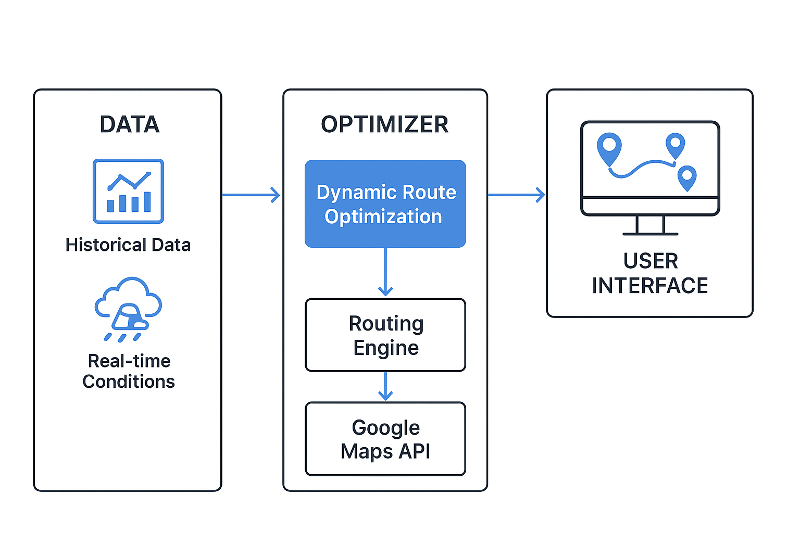

# 🚚 Dynamic Route Optimization

A Python-based dynamic route optimization system that calculates the most efficient delivery paths based on real-time constraints (traffic, distance, and priority).

---

## 📌 Features
- Dynamic route calculation using algorithms like Dijkstra & A*
- Real-time traffic consideration
- Flexible input for different city maps
- Containerized with Docker for easy deployment
- Automated build & deploy using GitHub Actions

---

## 🖼️ System Architecture


---

## 🎥 Demo


---

## 📦 Installation

### **1. Clone the Repository**
```bash
git clone https://github.com/viveksenn/dynamic-route-optimization.git
cd dynamic-route-optimization
