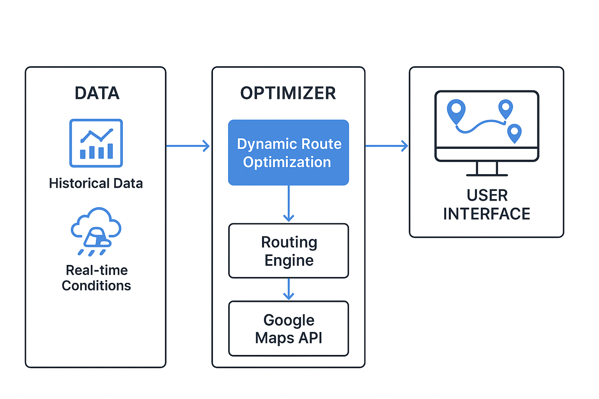

# Dynamic Route Optimization

Dynamic Route Optimization is a project designed to compute the most efficient path between multiple locations while considering various factors like traffic, distance, and constraints. This can be used in logistics, delivery systems, or navigation tools to reduce travel time and costs.

---

## 📌 Features
- Finds the optimal route between multiple points.
- Considers dynamic conditions like distance, constraints, and potential traffic data.
- Can be extended for real-time updates.
- Visual representation of optimized routes.
- Scalable for large datasets.

---

## 🛠️ Tech Stack
- **Python** for algorithm implementation
- **Dijkstra's Algorithm / A\*** for pathfinding
- **Matplotlib / NetworkX** for visualizations
- **Flask / FastAPI** (optional) for API-based usage

---

## 📂 Project Structure


---

## 📸 Architecture


---

## 🚀 Getting Started

### 1️⃣ Clone the Repository
```bash
git clone https://github.com/viveksenn/dynamic-route-optimization.git
cd dynamic-route-optimization

pip install -r requirements.txt

python src/main.py

Optimized route: A → C → D → B
Total distance: 12.4 km
